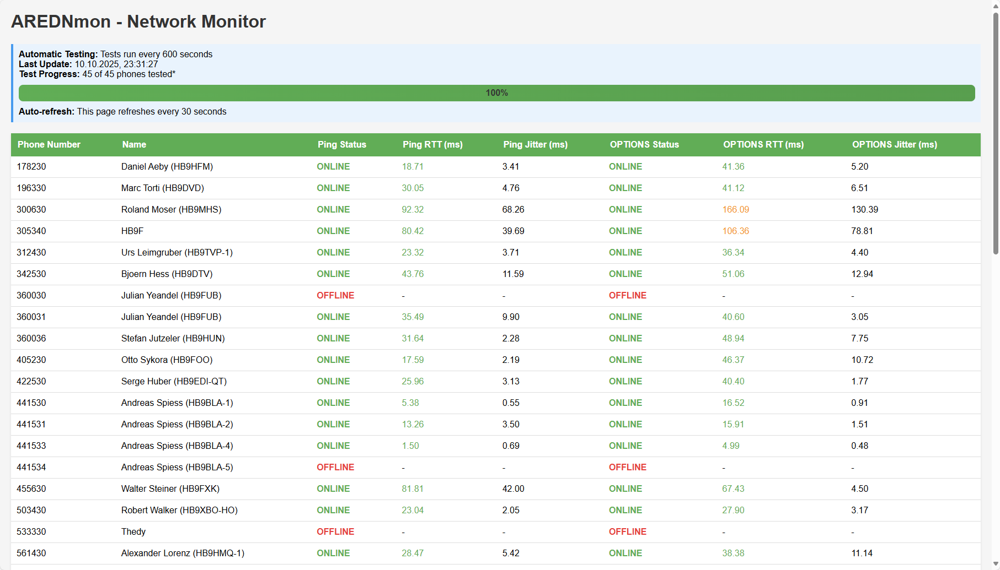

# 📞 AREDN Phonebook

> 🎯 **Emergency-Ready Directory & Monitoring for Amateur Radio Mesh Networks**

AREDN Phonebook provides SIP directory services and network monitoring for Amateur Radio Emergency Data Network (AREDN) mesh networks. During normal times, it automatically fetches a phonebook from common servers and maintains a copy on the router, making it easy for SIP phones to access directory listings across the mesh network. The router stores this phonebook so the latest copied version is always available.

## ✨ Features

- 🔄 **Automatic Directory Updates**: Downloads phonebook from mesh servers hourly (configurable)
- 🛡️ **Emergency Resilience**: Survives power outages with persistent storage
- 💾 **Flash-Friendly**: Minimizes writes to preserve router memory
- 🔌 **Plug-and-Play**: Works immediately after installation
- 📱 **Phone Integration**: Provides XML directory for SIP phones (tested with Yealink)
- 🔧 **Passive Safety**: Self-healing with automatic error recovery
- 📊 **AREDNmon Dashboard**: Real-time network topology visualization with interactive map
- 🗺️ **Network Topology**: Visual map showing routers, phones, and connections with RTT metrics
- 🔍 **Traceroute Visualization**: Interactive path tracing from server to any node on the map
- 🎯 **Dual-Mode Testing**: ICMP ping + SIP OPTIONS tests with RTT/jitter measurement
- 📈 **Performance Metrics**: Color-coded latency indicators for network quality assessment

> 🌐 **Access AREDNmon**: `http://[your-node].local.mesh/cgi-bin/arednmon`

## 📦 Installation

### 🔗 Download

Full AREDN Setup Guide: [AREDN Setup Documentation (PDF)](https://github.com/swissdigitalnet/AREDNstack/blob/main/Documentation/AREDN%20SetupV2.3-English.pdf)

1. Go to the [📥 Releases page](https://github.com/swissdigitalnet/AREDN-Phonebook/releases)
2. Download the latest `AREDN-Phonebook-x.x.x-x_[architecture].ipk` file for your device:
   - 🏠 **ath79**: Most common AREDN routers (e.g., Ubiquiti, MikroTik)
   - 💻 **x86**: PC-based AREDN nodes
   - 🔧 **ipq40xx**: Some newer routers

### 🌐 Install via AREDN Web Interface

1. 🌐 **Access AREDN Node**: Connect to your AREDN node's web interface

2. ⚙️ **Navigate to Administration**: Go to **Administration** → **Package Management**

   

3. 📤 **Upload Package**:
   - Click **Choose File** and select your downloaded `.ipk` file

     

4. ⚡ **Install**: Click **Fetch and Install**

5. ⚡ **Important**: After installation or upgrade, restart the service:
   ```bash
   /etc/init.d/AREDN-Phonebook restart
   ```

## ⚙️ Configuration (optional, not needed for most users)

The phonebook server automatically configures itself. Default settings:

- 📄 **Configuration**: `/etc/phonebook.conf`
- 🔧 **Service Commands**: `/etc/init.d/AREDN-Phonebook start|stop|restart|status`
- 🔌 **SIP Port**: 5060
- 🌐 **Directory URL**: `http://[your-node].local.mesh/arednstack/phonebook_generic_direct.xml`

### 🔧 Configuration Options

Edit `/etc/phonebook.conf` to customize settings:

```ini
# ============================================================================
# PHONEBOOK SETTINGS
# ============================================================================

# Phonebook Fetcher Interval - how often to download phonebook (seconds)
# Default: 3600 (1 hour)
PB_INTERVAL_SECONDS=3600

# Phonebook Servers - download sources for CSV phonebook
# Format: PHONEBOOK_SERVER=host,port,path
# Multiple servers can be added (tries in order until successful)
PHONEBOOK_SERVER=hb9bla-vm-tunnelserver.local.mesh,80,/filerepo/Phonebook/AREDN_Phonebook.csv
PHONEBOOK_SERVER=hb9edi-vm-gw.local.mesh,80,/filerepo/Phonebook/AREDN_Phonebook.csv

# ============================================================================
# PHONEBOOK SERVICE SETTINGS
# ============================================================================

# Status Update Interval - how often to check for phonebook changes (seconds)
# Default: 600 (10 minutes)
STATUS_UPDATE_INTERVAL_SECONDS=600

# ============================================================================
# MONITORING SETTINGS (UAC Testing)
# ============================================================================

# UAC Test Interval - how often to test all phones (seconds)
# Set to 0 to disable monitoring completely
# Default: 600 (10 minutes)
UAC_TEST_INTERVAL_SECONDS=600

# UAC Ping Test - ICMP ping count per phone (network layer)
# Tests network connectivity and measures RTT/jitter at IP level
# Range: 0-20, Default: 5, Set to 0 to disable
UAC_PING_COUNT=5

# UAC Options Test - SIP OPTIONS count per phone (application layer)
# Tests SIP connectivity and measures RTT/jitter at SIP level
# Range: 0-20, Default: 5, Set to 0 to disable
UAC_OPTIONS_COUNT=5

# UAC Call Test - enable INVITE testing (rings phone briefly)
# Only used as fallback if both ping and options fail
# 0 = disabled, 1 = enabled
# Default: 0 (disabled - recommended to avoid disturbing users)
UAC_CALL_TEST_ENABLED=0
```

**Monitoring Modes:**
- 🌐 **ICMP Ping** (network layer): Network connectivity and IP-level RTT/jitter
- 📊 **SIP OPTIONS** (application layer): SIP connectivity and application-level RTT/jitter
- 📞 **SIP INVITE** (optional): Fallback ring test if ping and OPTIONS fail

## 📱 Phone Setup

Configure your SIP phone to use the node's directory:

1. 🔗 **Directory URL**: `http://localnode.local.mesh/arednstack/phonebook_generic_direct.xml`
2. 📡 **SIP Server**: `localnode.local.mesh`
3. 🔄 **Refresh**: Directory updates automatically every xx seconds from router (your Update Time Interval)

## 📊 AREDNmon - Network Topology & Monitoring Dashboard

**Access**: `http://[your-node].local.mesh/cgi-bin/arednmon`



AREDNmon provides real-time network topology visualization and monitoring with an interactive web-based dashboard showing your mesh network structure and phone connectivity status.

### 🌐 Network Discovery Timeline
- **Immediate**: Phones are discovered via traceroute during first test cycle (10 minutes after start)
- **Background**: Network crawler continuously discovers routers and topology
- **Full visibility**: Complete network topology typically available within 30-60 minutes

### ✨ Dashboard Features

#### 🗺️ Network Topology Map
- 📍 **Interactive Map**: Switzerland-focused map showing all nodes with geographic locations
- 🔵 **Node Types**: Orange markers for routers, green for phones, grey for offline nodes
- 🔗 **Connection Lines**: Visual representation of network connections with RTT-based color coding
  - Green: Excellent (<100ms RTT)
  - Orange: Medium (100-200ms RTT)
  - Red: Poor (>200ms RTT)
  - Grey dashed: Unreachable connections
- 📊 **RTT Labels**: Shows round-trip times on router-to-router connections (visible when zoomed in)
- 🔍 **Interactive Features**: Click nodes to see details, hover over connections for RTT statistics
- 🎯 **New Node Discovery**: Automatically highlights newly discovered nodes in real-time

#### 🔍 Traceroute Visualization
- 🛣️ **Path Tracing**: Click any node to run traceroute from server to that node
- 💜 **Visual Path**: Purple solid lines overlay on map showing actual network path
- ⏱️ **Total Delay**: Displays cumulative RTT for entire path
- 📝 **Hop Details**: Shows each hop with hostname, IP address, and individual RTT

#### 📱 Phone Connectivity Testing
- 📈 **Real-time Status Display**: See all phones with ONLINE/OFFLINE/NO_DNS status
- 📊 **Performance Metrics**: RTT (round-trip time) and jitter measurements
- 🎨 **Color-coded Results**: Green (<100ms), Orange (100-200ms), Red (>200ms)
- 📱 **Contact Names**: Automatically shows names from phonebook
- 🔄 **Smart Caching**: Phonebook data cached in browser for performance
- ⚡ **Dual Testing**: Both ICMP ping and SIP OPTIONS tests

### 📋 Phone Status Table Columns
| Column | Description |
|--------|-------------|
| **Phone Number** | SIP extension number |
| **Name** | Contact name from phonebook |
| **Ping Status** | ICMP network-layer connectivity |
| **Ping RTT** | Network round-trip time in ms |
| **Ping Jitter** | Network jitter in ms |
| **OPTIONS Status** | SIP application-layer connectivity |
| **OPTIONS RTT** | SIP round-trip time in ms |
| **OPTIONS Jitter** | SIP jitter in ms |

### ⚙️ Test Configuration
Tests run automatically based on `/etc/phonebook.conf` settings:
- **Test Interval**: Default 600 seconds (10 minutes)
- **Ping Count**: Default 5 ICMP pings per phone
- **OPTIONS Count**: Default 5 SIP OPTIONS per phone
- Only phones with DNS resolution are tested (marked with * in phonebook)

### 💡 Status Meanings
- 🟢 **ONLINE**: Phone responded successfully to test
- 🔴 **OFFLINE**: DNS resolved but phone didn't respond
- ⚪ **NO DNS**: Phone hostname doesn't resolve (node not on mesh)
- ⚫ **DISABLED**: Testing disabled in configuration

## 🔗 Webhook Endpoints

### 🔄 Load Phonebook (Manual Refresh)
- 🌐 **URL**: `http://[your-node].local.mesh/cgi-bin/loadphonebook`
- 📡 **Method**: GET
- ⚡ **Function**: Triggers immediate phonebook reload
- 📋 **Response**: JSON with status and timestamp
- 🎯 **Use Case**: Manual refresh, testing, emergency situations

### 📊 Show Phonebook (API Access)
- 🌐 **URL**: `http://[your-node].local.mesh/cgi-bin/showphonebook`
- 📡 **Method**: GET
- 📖 **Function**: Returns current phonebook contents as JSON
- 📋 **Response**: JSON with entry count, last updated time, and full contact list
- 🎯 **Use Case**: Integration with other tools, status checking

### 📡 UAC Ping Test (Phone Monitoring)
- 🌐 **URL**: `http://[your-node].local.mesh/cgi-bin/uac_ping?target=441530&count=5`
- 📡 **Method**: GET
- 🎯 **Parameters**:
  - `target`: Phone number to test (required)
  - `count`: Number of pings (1-20, default: 5)
- ⚡ **Function**: Sends SIP OPTIONS ping requests and measures RTT/jitter
- 📋 **Response**: JSON with test status
- 📈 **Metrics**: Min/max/avg RTT, jitter, packet loss percentage
- 🎯 **Use Case**: Diagnose phone connectivity, measure network quality
- 💡 **Note**: Non-intrusive test (doesn't ring the phone)

## 🔧 Troubleshooting

### ✅ Check Service Status
```bash
ps | grep AREDN-Phonebook
logread | grep "AREDN-Phonebook"
```

### 📂 Verify Directory Files
```bash
ls -la /www/arednstack/phonebook*
curl http://localhost/arednstack/phonebook_generic_direct.xml
```

### ⚠️ Common Issues

- 📅 **No directory showing**: Wait up to 1 hour for first download, or trigger immediate download via webhook
- 🚫 **Service not starting**: Check logs with `logread | tail -50`
- 🔒 **Permission errors**: Ensure `/www/arednstack/` directory exists

## 🔬 Technical Details

- 🚀 **Emergency Boot**: Loads the existing phonebook immediately on startup
- 💾 **Persistent Storage**: Survives power cycles using `/www/arednstack/`
- 🛡️ **Flash Protection**: Only writes when phonebook content changes
- 🧵 **Multi-threaded**: Background fetching doesn't affect SIP performance
- 🔧 **Auto-healing**: Recovers from network failures and corrupt data
- 📊 **RFC3550 Metrics**: Industry-standard jitter calculation for voice quality
- 🎯 **Smart Testing**: DNS pre-check reduces unnecessary SIP traffic
- ⚡ **Fast Detection**: 50ms polling for sub-second phone status updates

## 🆘 Support

- 🐛 **Issues**: [GitHub Issues](https://github.com/swissdigitalnet/AREDN-Phonebook/issues)
- 📚 **Documentation**: [Functional Specification](docs/AREDN-phonebook-fsd.md)
- 📖 **Setup Guide**: [AREDN Setup Documentation (PDF)](https://github.com/swissdigitalnet/AREDNstack/blob/main/Documentation/AREDN%20SetupV2.3-English.pdf)
- 🌐 **AREDN Community**: [AREDN Forums](https://www.arednmesh.org/)

## 📄 License

This project is released under open source license for amateur radio emergency communications.
