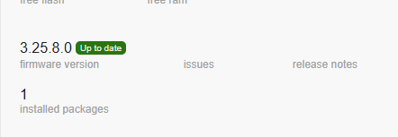
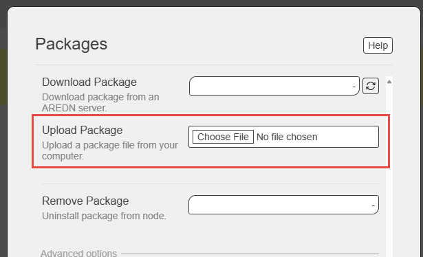

# AREDN Phonebook

AREDN Phonebook is a SIP server that provides directory services for Amateur Radio Emergency Data Network (AREDN) mesh networks. During normal times, It automatically fetches a phonebook from common servers and maintains a copy on the router, making it easy for SIP phones to access directory listings across the mesh network. The router stores this phonebook so the lates copied version is always available.

## Features

- **Automatic Directory Updates**: Downloads phonebook from mesh servers every 30 minutes
- **Emergency Resilience**: Survives power outages with persistent storage
- **Flash-Friendly**: Minimizes writes to preserve router memory
- **Plug-and-Play**: Works immediately after installation
- **Phone Integration**: Provides XML directory for SIP phones (tested with Yealink)
- **Passive Safety**: Self-healing with automatic error recovery

## Installation

### Download

1. Go to the [Releases page](https://github.com/dhamstack/AREDN-Phonebook/releases)
2. Download the latest `AREDN-Phonebook-x.x.x-x_[architecture].ipk` file for your device:
   - **ath79**: Most common AREDN routers (MikroTik hap lite, small white)
   - **x86**: PC-based AREDN nodes (e.g. Proxmos)
   - **ipq40xx**: (Mikrotik hap3, bigger black)

### Install via AREDN Web Interface

1. **Access AREDN Node**: Connect to your AREDN node's web interface

2. **Navigate to Administration**: Go to **Administration** → **Package Management**

   

3. **Upload Package**:
   - Click **Choose File** and select your downloaded `.ipk` file

     

4. **Install**: Click **Fetch and Install**

### Configure Your Yealink Phone

After installation, configure your Yealink phone to access the AREDN phonebook:

**Directory URL for Yealink phones:**
```
http://localnode.local.mesh/arednstack/phonebook_generic_direct.xml
```

**Steps:**
1. Access your phone's web interface (usually `http://[phone-ip]`)
2. Go to **Directory** → **Remote Phone Book**
3. Set **Remote URL** to: `http://localnode.local.mesh/arednstack/phonebook_generic_direct.xml`
4. Set **Name** to: `AREDN Phonebook`
5. **Save** and **Reboot** the phone

## Account Configuration

- **SIP Port**: 5060
- **Directory URL**: `http://localhost.local.mesh`

## Webhook Endpoints

### Load Phonebook (Manual Refresh)
- **URL**: `http://[your-node].local.mesh/cgi-bin/loadphonebook`
- **Method**: GET
- **Function**: Triggers immediate phonebook reload
- **Response**: JSON with status and timestamp
- **Use Case**: Manual refresh, testing, emergency situations

### Show Phonebook (API Access)
- **URL**: `http://[your-node].local.mesh/cgi-bin/showphonebook`
- **Method**: GET
- **Function**: Returns current phonebook contents as JSON
- **Response**: JSON with entry count, last updated time, and full contact list
- **Use Case**: Integration with other tools, status checking

## Troubleshooting

http://[your-node].local.mesh/cgi-bin/loadphonebook` should load the phonebook from the server
http://[your-node].local.mesh/cgi-bin/showphonebook` should show the phonebook on your router

### Check Service Status in ssh terminal
```bash
ps | grep AREDN-Phonebook
/etc/init.d/AREDN-Phonebook status
```

### Check Installation and Version
```bash
opkg list-installed | grep AREDN-Phonebook
```

### Verify Directory Structure
```bash
ls -la /www/
ls -la /www/arednstack/
ls -la /www/cgi-bin/
```

### Check Logs for Errors
```bash
logread | grep -i "AREDN-Phonebook\|directory\|www"
logread -f | grep AREDN-Phonebook
```

### Verify Phonebook Files
```bash
ls -la /www/arednstack/phonebook*
curl http://localhost/arednstack/phonebook_generic_direct.xml
```

### Test Webhook Endpoints
```bash
# Trigger immediate phonebook reload
curl http://localhost/cgi-bin/loadphonebook

# Show current phonebook contents
curl http://localhost/cgi-bin/showphonebook
```

### Manual Directory Creation (if needed)
```bash
mkdir -p /www/arednstack
/etc/init.d/AREDN-Phonebook restart
```

### Check Filesystem and Permissions
```bash
df -h /www
mount | grep www
```

### Common Issues

- **No directory showing**: Wait up to 30 minutes for first download or use `curl http://localhost/cgi-bin/loadphonebook`
- **Service not starting**: Check logs with `logread | tail -50`
- **Permission errors**: Ensure `/www/arednstack/` directory exists
- **Webhooks not working**: Verify CGI scripts installed with `ls -la /www/cgi-bin/`

## Technical Details

- **Emergency Boot**: Loads the existing phonebook immediately on startup
- **Persistent Storage**: Survives power cycles using `/www/arednstack/`
- **Flash Protection**: Only writes when phonebook content changes
- **Multi-threaded**: Background fetching doesn't affect SIP performance
- **Auto-healing**: Recovers from network failures and corrupt data

## Support

- **Issues**: [GitHub Issues](https://github.com/dhamstack/AREDN-Phonebook/issues)
- **Documentation**: [Functional Specification](AREDN-phonebook-fsd.md)
- **AREDN Community**: [AREDN Forums](https://www.arednmesh.org/)

## License

This project is released under open source license for amateur radio emergency communications.
